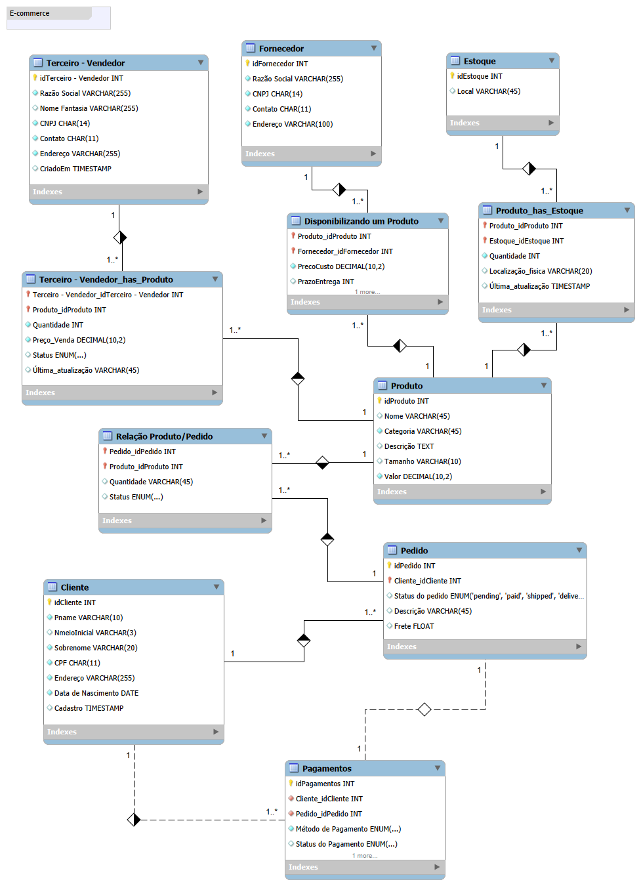

# Projeto de Banco de Dados E-commerce

Este repositório contém o desafio de projeto de modelagem e implementação de um banco de dados para um cenário de E-commerce.

## 📌 Estrutura do Projeto

O projeto está dividido em três partes principais:

1.  **Esquema Relacional (`01_schema_creation.sql`):** Script de criação das tabelas e definição de constraints (PK, FK, Unique).
2.  **Persistência de Dados (`02_data_insertion.sql`):** Script para popular o banco de dados com dados fictícios para testes.
3.  **Análise de Dados (`03_queries_analysis.sql`):** Diversas consultas SQL para extração de informações, incluindo Joins, Group By, Having e Atributos Derivados.

## 🗺️ Modelo Conceitual

## 🚀 Como executar
Para replicar o projeto, execute os scripts na seguinte ordem:
1. `01_schema_creation.sql`
2. `02_data_insertion.sql`
3. `03_queries_analysis.sql`

## 🛠️ Tecnologias Utilizadas
- MySQL
- MySQL Workbench
- Git/GitHub